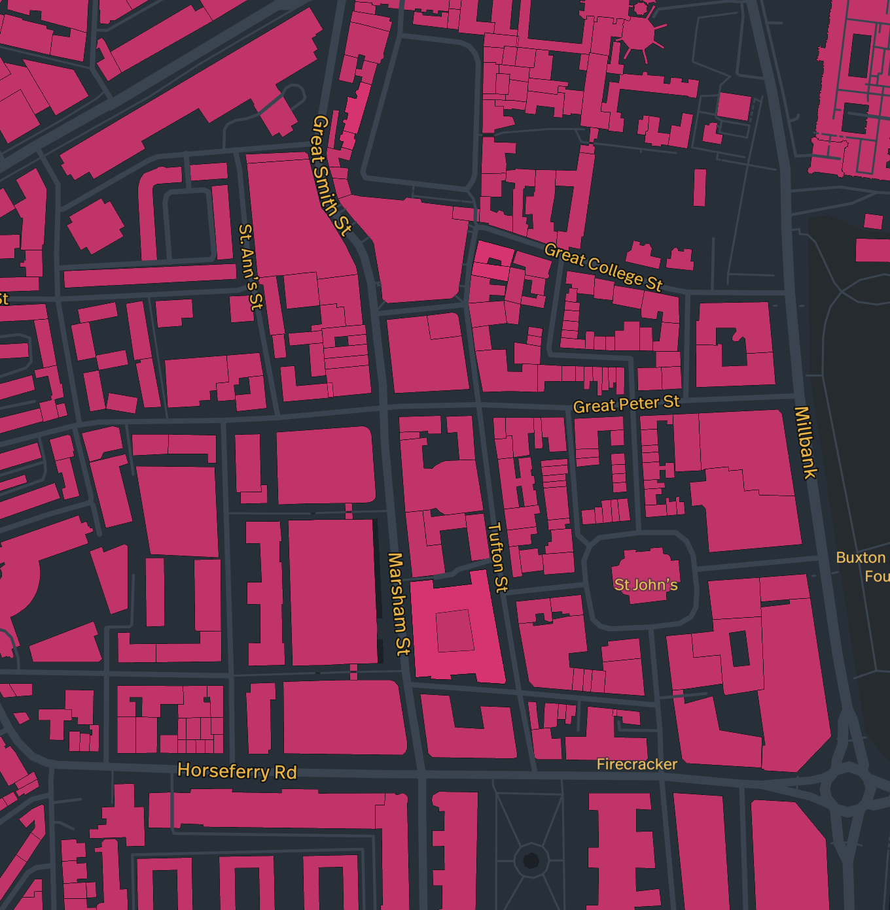

# brutalist-map

Planning:

Building:

- deployed with Netlify on a subdomain of my website, jackkershaw.net.
- made a custom designed map with mapbox studio.

Debugging:

## TODO:

- fix map not loading with .env file netlify - might have to use express js.
- change color scheme/style of map - make own style with mapbox studio
- change color scheme of site
- add markers for brutalist buildings
- add popups when tap on markers
- Make it better: https://www.youtube.com/watch?v=OySigNMXOZU
- work out if this would help: map.on("load", () => {
  map.addSource("places", {
  type: "geojson",
  data: places,
  });

Resources:

- https://socialistmodernism.com/
- https://www.sosbrutalism.org/cms/15802395#map
- https://bluecrowmedia.com/products/brutalist-london-map
- https://strikemap.org
- https://pnote.eu/projects/invaders/map.html
- https://www.are.na/gemma-copeland/community-maps
- Brutalist map with apis: To find information about brutalist buildings in London, you might consider using APIs that provide data related to architecture, landmarks, or historical sites. Here are a few suggestions: 1. **Google Maps Geocoding API:** You can use this API to search for specific addresses or landmarks related to brutalist architecture in London. 2. **Foursquare API:** Foursquare's Places API can be used to discover and retrieve information about various buildings, architectural landmarks, or specific locations in London. 3. **OpenStreetMap API:** OpenStreetMap offers APIs that allow you to access information about specific locations, including architectural landmarks, buildings, and more. 4. **Historic England API:** This API provides access to information about historic sites and buildings in England, including brutalist architecture. It might contain detailed data about such structures in London. Remember to check the API documentation for usage policies, limitations, and available endpoints related to architecture or landmarks before integration into your project.

Overpass API: This API allows you to query specific data from the OpenStreetMap database. You can construct queries to retrieve information about buildings tagged as brutalist in London. For example, you can query buildings with specific tags like \"brutalist\" and within the geographic bounds of London.Nominatim API: Nominatim is OSM's search engine API. You can search for places by name or category, such as \"brutalist buildings in London,\" and receive information about matching locations.
